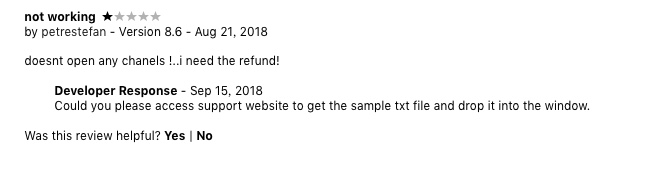
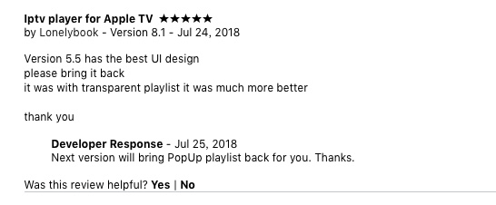

## 欢迎光临，谢谢惠顾！

## IPTV网络电视播放器（OSX苹果电脑版）

### 电子邮箱：yu_tian_jian@163.com  欢迎随时联系。

### 敬请访问：[http://www.yutianjian.com](http://www.yutianjian.com)

IPTV网络电视播放器, 在您的iMac或MBP上看电视直播，听广播，可以替代电视盒子+显示器，省钱省事省空间。
网络电视直播资源十分丰富，只要花点时间，下点功夫，多泡坛子，就能找到您想看的、丰富多彩的、世界各地的电视电影。

本播放器仅仅只是一个播放工具，自身不带任何直播源地址，想看什么电视、电影频道，完全由自己制作的播放列表文件确定，
只需将制作好的播放列表文件拖入播放窗口或打开即可，操作极其简单。

## 播放器使用说明

虽然播放器操作比较简单，但为让大家更好的了解播放器的各种功能，特编写播放器的使用说明，建议下载看看。

- [下载播放器使用说明](https://TVPlayerSupport.github.io/Playlist/IPTVPlayerGuidelines.pdf) 

## AirPlay可以支持AppleTV

用户iBurning经过实际测试，iMac和AppleTV通过wifi连接到家庭局域网时，播放器的视频可以隔空投放到AppleTV。
谢谢iBurning。

## 播放器主要功能

- 支持m3u8广播电视直播。
- 支持mp4视频点播。
- 支持的视频格式有m3u8, mp4, mp3. . . . . .
- 支持全屏播放。
- 支持文件的拖放操作。
- 支持txt和m3u格式播放文件列表并自动保存。
- 不同名文件自动保存，同名文件刷新内容。
- 如需更新，编辑新文件后，再次打开或拖入窗口即可。
- 窗口大小从480x320到全屏可调整。
- 可保持或取消视频窗口始终在前台，方便边做事边看电视（通过左上菜单操作）。
- 播放频道记忆功能，每次启动运行，自动播放上次观看的频道。
- 支持频道个人收藏。

## 优点

- 虽然网络电视直播资源十分丰富，但有些源地址有效期较短，甚至以小时计算。因此，如果源地址不能定制，那么，无论App里自带多少源地址，过不了多久，都会无源可看。与其被动的等待App更新，源地址由用户自己定制，更加灵活，有明显的优势。

- 电视盒子+显示器，硬件价格最低也在千元左右；还要连接数据线，摆放显示器的空间。IPTV网络电视播放器恐怕比一根数据线的价格还便宜，无需额外空间、电源及数据连线，省钱省事省空间。

## 缺点

- 由于App本身不带任何直播源地址，用户需要自己制作播放列表文件。既要编辑、修改播放列表文件，又要自己搜索找源，对新手稍微有点麻烦。
其实，制作播放列表文件并不复杂，双击播放列表模版文件（下载链接在下面）即可打开文件，然后，将您找到的新源地址，复制粘贴进去就可以。

- 播放流畅性与有线电视或电视盒子相比，肯定是不如的。
经过一段时间的测试和实际使用，只要找到稳定的源，播放还是很流畅的。

## 播放列表文件制作说明

### A. 制作txt格式播放列表文件

文件命名为：xxx.txt，然后，按以下格式编辑文件的内容。
- 广播电视台名称,直播源地址链接。
- 每行一个广播电视台，名称与地址之间由逗号（,）分隔。逗号请用英文（半角）方式输入。
- 具体文件格式，请参考模版文件。

注意：

除了每行用分隔符“逗号”分隔电视台名称和m3u8地址外，没有其余要求。
为了让您的源地址文件阅读更美观、层次感更好一些，您可以：
在源文件中使用空行，说明文字，不过，无用的行，一定不要包括“逗号”。
没有分隔符“逗号”的行，比如空行或说明行，App在读取源地址时是自动跳过的，不会显示在播放列表中。

### B. 制作m3u（格式1）播放列表文件
    
  将播放列表文件命名为：xxx.txt，然后，按以下格式编辑并保存文件：
    
- #EXTM3U
- #EXTINF:-1 tvg-logo="sample.png" group-title="No group",Channel 1
- Channel 1,https://edge.music-choice-play-chaina/play/chunklist.m3u8
- #EXTINF:-1 tvg-logo="sample.png" group-title="No group",Channel 2
- Channel 2,https://nhkworld.webcdn.stream.ne.jp/live_wa_s.m3u8
- #EXTINF:-1 tvg-logo="sample.png" group-title="No group",Channel 3
- Channel 3,http://77.89.199.174:81/hls/live2.m3u8
- 等等. . . . . .
- 将xxx.txt保存为UTF-8格式, 最后将xxx.txt的扩展名改为xxx.m3u。

### C. 制作m3u（格式2）播放列表文件
    
  将播放列表文件命名为：xxx.txt，然后，按以下格式编辑并保存文件：
    
- #EXTM3U
- #EXTINF:-1 tvg-logo="sample.png" group-title="No group",Channel 1
- https://edge.music-choice-play-chaina/play/chunklist.m3u8
- #EXTINF:-1 tvg-logo="sample.png" group-title="No group",Channel 2
- https://nhkworld.webcdn.stream.ne.jp/live_wa_s.m3u8
- #EXTINF:-1 tvg-logo="sample.png" group-title="No group",Channel 3
- http://77.89.199.174:81/hls/live2.m3u8
- 等等. . . . . .
- 将xxx.txt保存为UTF-8格式, 最后将xxx.txt的扩展名改为xxx.m3u。

## 沟通与交流

- 播放器上线以后，一些用户根据自己的使用情况，提出了使用和功能方面的意见和建议，这里截图汇总几个有代表性的。

- 播放器上线之初，虽然知道源文件制作会是一个焦点，但除了尽量把文件制作说明写的更详细一些外，没有什么经验，不知道该如何做，并没有提供模版文件下载。自然，有关这个问题在评价里就出现了，还不少，根据用户的反馈，首先尝试在自己的xl博客上提供一些源地址，后来制作成txt文件以供下载，情况有所好转，可时间不长，被认定违规，博客被永久关闭，才建了这个网页，但又有人找不到支持页面，来邮件的都一一回复，没有邮件联系的，也无可奈何，只能希望他们能自己找到网页。至于有反馈说支持页面打不开，只能望洋兴叹，境外服务器，有时候就是慢，偶尔还打不开。

- 不光是国内用户存在问题，发达的美国用户也一样，看到上面的评论，因他没有发邮件联系，就只能在商店给他回复，确实不知道他用的什么地址和格式，一个都打不开确实也很奇怪。

- 因我比较享受拖放操作，开始并没有计划做保存列表的功能。根据这位用户的反馈，增加了自动保存列表功能。

- 纯粹的全屏也是反馈较多的，还有播放列表的长度问题，几千个地址拉下来，确实不方便找频道，但一直没有下决心彻底改代码，一来自己觉得电视画面上下部本来就有一条黑边，用来摆放几个按钮也是合理的；二是代码修改量很大，几乎相当于要全部重新写代码，包括数据库结构都需要重新设计，因为需要增加分类保存功能。原来窗口上部和下部放有一些操作键，播放列表是下拉式的，不能实现分类功能。因为反映比较强烈，也专门就要不要彻底升级跟iBurning探讨过，他也建议改，最后下决心进行彻底的改进和升级，夜以继日的重写代码，取消了所有的窗口内操作按钮，将下拉式列表改为列表式，增加了分类保存功能，实现了纯粹的全屏。

- 在这里要特别感谢用户iBurning，提出了许多改进建议，前面的大更新，我们经常讨论，他还专门制作视频录像给我发过来，我在更新之前也会先发截图让他看看，听听他的意见，他提出了很多非常好的建议，比如鼠标控制列表的显示与隐藏，这一非常方便的控制功能就是他首先提出的改进意见，等等。如今，我们已经成为朋友了。

- 经过上面的升级后，国内用户比较满意，可是一个美国用户却不能接受，他应该是版本5.5之前购买的，此前他发表评论希望我开发播放器的AppleTV版本，升级到版本8.1时，他无法忍受了，一边在商店里修改评论，一边给我发邮件沟通，要求返回到原先的版本。返回到原来的版本肯定不行，国内用户不会答应，但这个美国用户一再坚持喜欢老版本，也必须满足他的要求。经过多次沟通，专门又把下拉式列表添加上去。不过，下拉式列表一般情况是隐藏的，要使用的话，自己通过菜单操作显示出来，这样的设计他表示可以接受，当然，我也告诉他更多的人喜欢改进后的列表方式。

- 感谢所有给予播放器善意、中肯评价的用户，无论是好评还是差评，好评让我欣慰，差评我将尽力改进。

## 模版文件
- [查看模版文件详情。](http://TVPlayerSupport.github.io/Details/)
- 2018年11月02日更新
- [下载模版文件](https://TVPlayerSupport.github.io/Playlist/myTVsrc.txt.zip) 
- 
- m3u（格式1）模版文件（仅供参考）
- [下载m3u（格式1）模版文件](https://TVPlayerSupport.github.io/txt/M3U-1.m3u.zip)
- 
- m3u（格式2）模版文件（仅供参考）
- [下载m3u（格式2）模版文件](https://TVPlayerSupport.github.io/txt/M3U-2.m3u.zip)

## 感谢与希望

- 再次感谢大家的支持。
- 希望继续提出有关要求或建议。

