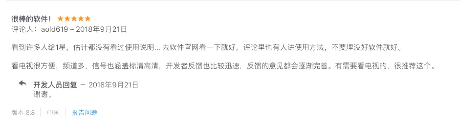
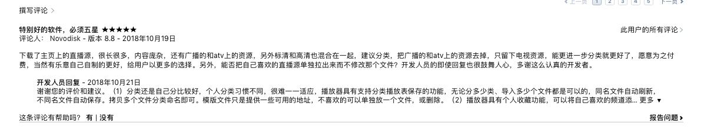

## 欢迎光临，谢谢惠顾！

## IPTV网络电视播放器（Mac OSX苹果电脑版）

### 电子邮箱：yu_tian_jian@163.com  欢迎随时联系。

### 敬请访问：[http://www.yutianjian.com](http://www.yutianjian.com)

IPTV网络电视播放器, 在您的iMac或MBP上看电视直播，听广播，可以替代电视盒子+显示器，省钱省事省空间。
网络电视直播资源十分丰富，只要花点时间，下点功夫，多泡坛子，就能找到您想看的、丰富多彩的、世界各地的电视电影。

本播放器仅仅只是一个播放工具，自身不带任何直播源地址，想看什么电视、电影频道，完全由自己制作的播放列表文件确定，
只需将制作好的播放列表文件拖入播放窗口或打开即可，操作极其简单。

为了使用播放器，您必须自己制作播放列表文件，制作文件并不复杂，参考播放器使用说明，以及模版文件格式，相信您很快就能制作出自己的播放列表文件。

## 播放器使用说明(Mac OSX)

虽然播放器的操作使用比较简单，还是建议下载看看，主要内容包括：

- 播放器的基本操作。
- 播放列表文件的制作。
- 分享发布资源的论坛。

- [下载播放器使用说明 (第四版2018-11-09更新)](https://TVPlayerSupport.github.io/Playlist/IPTVPlayerGuidelines.pdf) 

## AirPlay可以支持AppleTV

用户iBurning经过实际测试，iMac和AppleTV通过wifi连接到家庭局域网时，播放器的视频可以隔空投放到AppleTV。
谢谢iBurning。

## 播放器主要功能

- 支持m3u8广播电视直播。
- 支持mp4视频点播。
- 支持的视频格式有m3u8, mp4, mp3. . . . . .
- 支持全屏播放。
- 支持文件的拖放操作。
- 支持txt和m3u格式播放文件列表并自动保存。
- 不同名文件自动保存，同名文件刷新内容。
- 如需更新，编辑新文件后，再次打开或拖入窗口即可。
- 窗口大小从480x320到全屏可调整。
- 可保持或取消视频窗口始终在前台，方便边做事边看电视（通过左上菜单操作）。
- 播放频道记忆功能，每次启动运行，自动播放上次观看的频道。
- 支持频道个人收藏。
- 附带TXT和M3U列表文件转换工具。

## 优点

- 虽然网络电视直播资源十分丰富，但有些源地址有效期较短，甚至以小时计算。因此，如果源地址不能定制，那么，无论App里自带多少源地址，过不了多久，都会无源可看。与其被动的等待App更新，源地址由用户自己定制，更加灵活，有明显的优势。

- 电视盒子+显示器，硬件价格最低也在千元左右；还要连接数据线，摆放显示器的空间。IPTV网络电视播放器恐怕比一根数据线的价格还便宜，无需额外空间、电源及数据连线，省钱省事省空间。

## 缺点

- 由于App本身不带任何直播源地址，用户需要自己制作播放列表文件。既要编辑、修改播放列表文件，又要自己搜索找源，对新手稍微有点麻烦。
其实，制作播放列表文件并不复杂，双击播放列表模版文件（下载链接在下面）即可打开文件，然后，将您找到的新源地址，复制粘贴进去就可以。

- 播放流畅性与有线电视或电视盒子相比，肯定是不如的。
经过一段时间的测试和实际使用，只要找到稳定的源，播放还是很流畅的。

## 播放列表文件制作说明

### A. 制作txt格式播放列表文件

文件命名为：xxx.txt，然后，按以下格式编辑文件的内容。
- 广播电视台名称,直播源地址链接。
- 每行一个广播电视台，名称与地址之间由逗号（,）分隔。逗号请用英文（半角）方式输入。
- 具体文件格式，请参考模版文件。

注意：

除了每行用分隔符“逗号”分隔电视台名称和m3u8地址外，没有其余要求。
为了让您的源地址文件阅读更美观、层次感更好一些，您可以：
在源文件中使用空行，说明文字，不过，无用的行，一定不要包括“逗号”。
没有分隔符“逗号”的行，比如空行或说明行，App在读取源地址时是自动跳过的，不会显示在播放列表中。

### B. 制作m3u(格式1)播放列表文件
    
  将播放列表文件命名为：xxx.txt，然后，按以下格式编辑并保存文件：
    
- #EXTM3U
- #EXTINF:-1 tvg-logo="sample.png" group-title="No group",Channel 1
- Channel 1,https://edge.music-choice-play-chaina/play/chunklist.m3u8
- #EXTINF:-1 tvg-logo="sample.png" group-title="No group",Channel 2
- Channel 2,https://nhkworld.webcdn.stream.ne.jp/live_wa_s.m3u8
- #EXTINF:-1 tvg-logo="sample.png" group-title="No group",Channel 3
- Channel 3,http://77.89.199.174:81/hls/live2.m3u8
- 等等. . . . . .
- 将xxx.txt保存为UTF-8格式, 最后将xxx.txt的扩展名改为xxx.m3u。

### C. 制作m3u(格式2)播放列表文件
    
  将播放列表文件命名为：xxx.txt，然后，按以下格式编辑并保存文件：
    
- #EXTM3U
- #EXTINF:-1 tvg-logo="sample.png" group-title="No group",Channel 1
- https://edge.music-choice-play-chaina/play/chunklist.m3u8
- #EXTINF:-1 tvg-logo="sample.png" group-title="No group",Channel 2
- https://nhkworld.webcdn.stream.ne.jp/live_wa_s.m3u8
- #EXTINF:-1 tvg-logo="sample.png" group-title="No group",Channel 3
- http://77.89.199.174:81/hls/live2.m3u8
- 等等. . . . . .
- 将xxx.txt保存为UTF-8格式, 最后将xxx.txt的扩展名改为xxx.m3u。

## 用户协议

- 本播放器仅支持用户自己创建的TXT和M3U格式的播放列表。
- 本软件不提供任何播放列表和电视频道。
- 播放器或许提供模版文件，但模版文件不包括任何可用频道或资源，仅供用户参考其文件格式。
- 本软件的用户应保证其列表中播放视频的合法性。
- 用户负责查验播放列表中的内容的合法性和使用权。
- 本软件不负责上述合法性和使用权的查验。
- 使用本软件即表示您已经接受上述条款。

## 免责声明

- 本软件不包括也不提供任何视频内容。
- 本软件与任何内容提供方都没有关联。
- 用户自己查验观看内容的合法性和使用权。
- 未经版权所有人许可，本软件不认可版权保护资料的流通。

## 模版文件

- 模版文件内包含的资源均不可用，仅供您制作播放列表文件时参考其格式。
- 如有问题请发邮件联系：yu_tian_jian@163.com

- 下列TXT模版文件内包含的资源均不可用，仅供您制作播放列表文件时参考其格式。
- [下载TXT模版文件](https://TVPlayerSupport.github.io/Playlist/Playlist-Sample-Cn.txt.zip) 

- 下列M3U(格式1)模版文件内包含的资源均不可用，仅供您制作播放列表文件时参考其格式。
- [下载M3U模版文件](https://TVPlayerSupport.github.io/Playlist/M3U-Sample-1.m3u.zip)

- 下列M3U(格式2)模版文件内包含的资源均不可用，仅供您制作播放列表文件时参考其格式。
- [下载M3U模版文件](https://TVPlayerSupport.github.io/Playlist/M3U-Sample-2.m3u.zip)

## 感谢与希望

- 感谢所有给予播放器善意、中肯评价的用户，好评让我欣慰。
- 希望继续提出有关要求或建议，我将更加努力改进播放器。

