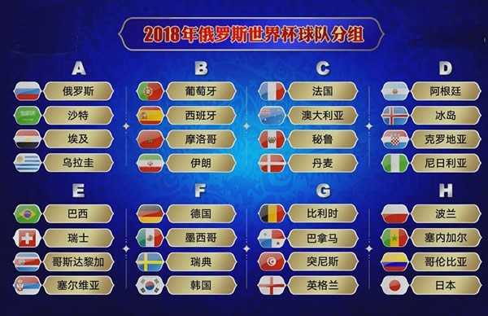
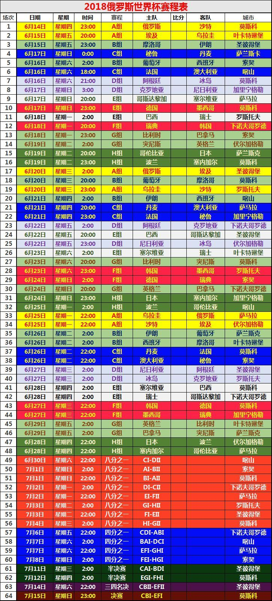
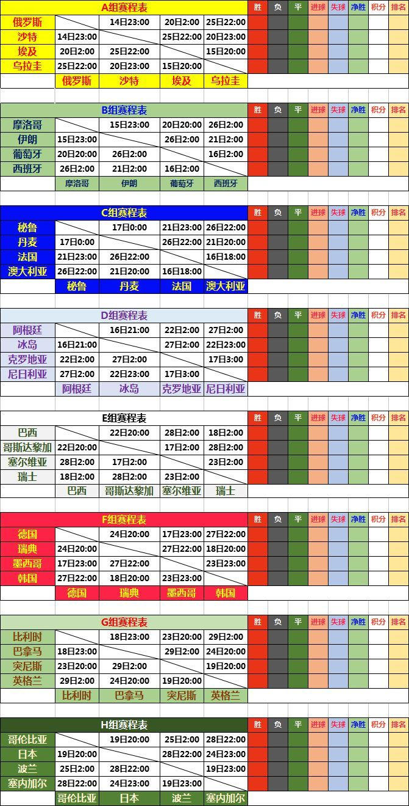

## 欢迎光临，谢谢惠顾！

## 广播电视直播源Player技术支持（iMac苹果电脑版）

### 电子邮箱：yu_tian_jian@163.com  欢迎随时联系。

### 敬请访问：[http://www.yutianjian.com](http://www.yutianjian.com)

### 看世界杯，增加世界杯直播源专题！！！

广播电视直播源Player, 在您的iMac上看电视，听广播，可以替代电视盒子+显示器，省钱省事省空间。
网络电视直播资源十分丰富，只要花点时间，就能找到您想看的、世界各地的电视、电影直播源地址。
App本身不带任何直播源地址，支持用户自己定制，想看什么电视、电影频道，完全由自己制作的源文件确定。
只需将广播电视直播源地址文件拖入播放窗口或打开即可。

## 功能

- 支持m3u8广播电视直播（广播电视直播源地址文件由用户定制）。
- 支持mp4视频点播。
- 支持的视频格式有m3u8, mp4, mov, mpg, mp3. . . . . .
- 支持全屏播放。
- 支持文件的拖放操作。
- 支持播放文件列表。
- 自动保存最新打开或拖入的直播源文件，如需更新，编辑新文件后，再次打开或拖入窗口即可。
- 窗口大小从480x320到全屏可调整。
- 可保持或取消视频窗口始终在前台，方便边做事边看电视（通过左上菜单操作）。
- 音量调节（点击音量图标或音量显示条可增加或降低音量）。
- 播放频道记忆功能，每次启动运行，自动播放上次观看的频道。

## 优点

- 虽然网络电视直播资源十分丰富，但有些源地址有效期较短，甚至以小时计算。因此，如果源地址不能定制，那么，无论App里自带多少源地址，过不了多久，都会无源可看。与其被动的等待App更新，源地址由用户自己定制，更加灵活，有明显的优势。

- 电视盒子+显示器，硬件价格在千元左右；还要连接数据线，摆放显示器的空间。广播电视直播源Player恐怕比一根数据线的价格还便宜，无需额外空间、电源及数据连线，省钱省事省空间。

## 缺点

- 由于App本身不带任何直播源地址，用户需要自己制作源地址文件。既要编辑、修改源文件，又要自己搜索找源，稍微有点麻烦。
其实，制作源地址文件并不复杂，双击源地址模版文件（下载链接在下面）即可打开文件，然后，将您找到的新源地址，复制粘贴进去就可以。

- 播放流畅性与有线电视或电视盒子相比，肯定是不如的。
经过一段时间的测试和实际使用，只要找到稳定的源，播放还是很流畅的。

## 格式定义

文件命名为：xxx.txt，然后，按以下格式编辑文件的内容。
- 广播电视台名称,直播源地址链接。
- 每行一个广播电视台，名称与地址之间由逗号（,）分隔。逗号请用英文（半角）方式输入。
- 具体文件格式，请下载源地址模版文件。

注意：

除了每行用分隔符“逗号”分隔电视台名称和m3u8地址外，没有其余要求。
为了让您的源地址文件阅读更美观、层次感更好一些，您可以：
在源文件中使用空行，说明文字，不过，无用的行，一定不要包括“逗号”。
没有分隔符“逗号”的行，比如空行或说明行，App在读取源地址时是自动跳过的，不会显示在播放列表中。

## 重要提示

- 因源地址有效期短，请自己主动搜索新源替换，相信你能找到自己喜欢的、流畅稳定的源。
- 不保证模版文件中所有源都有效流畅，有些俗称短命源，有效时间仅一天或几个小时，过期是正常的。
- 不承诺长期更新。

## 模版文件

- 源地址模版文件中包括央视、各省市台等直播源地址，[主要内容详见](https://TVPlayerSupport.github.io/Details/)。
- 如果出现卡顿、失效的源，请自己删除。
- 为减少源地址列表长度，可分类制作多个源文件，看什么拖什么。
- 2018年06月15日（提前）更新。（看世界杯，增加世界杯专题直播源）。
- [下载源地址模版文件](https://TVPlayerSupport.github.io/txt/myTVsrc.txt.zip)

## 源地址名称显示错误的解决办法

- 有时候，源地址名称播放列表可能出现显示错误的情况，或在源地址列表中无法显示某个源地址。
- 导致在选择某个源地址进行播放时，实际播放的却是另一个频道。
- 出现这种错误的原因一般是：源地址名称出现相同的情况。
- 解决办法：修改源地址名称，使2者有所区别。比如：天元围棋1，另一个则改为：天元围棋2。
- 这样就可以解决出现源地址名称显示错误的问题。
- 这个bug排查过多次，没有解决，目前，只能避免使用同名。

## 要求和建议

- 欢迎提出有关要求或建议。

